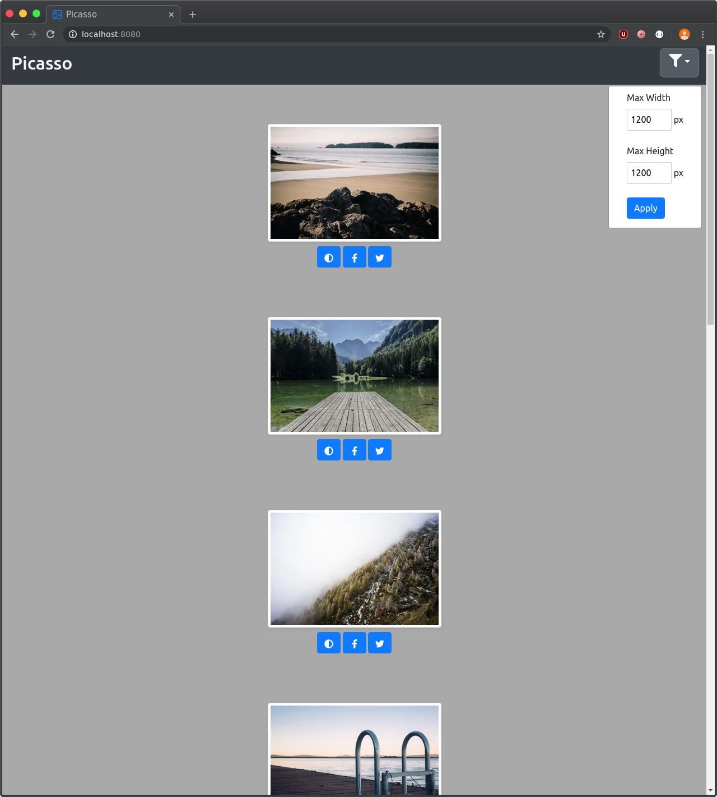
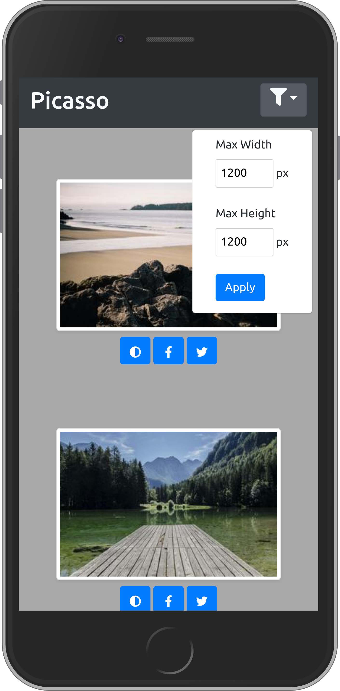
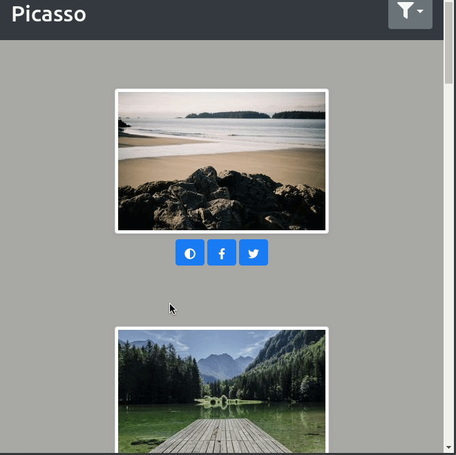
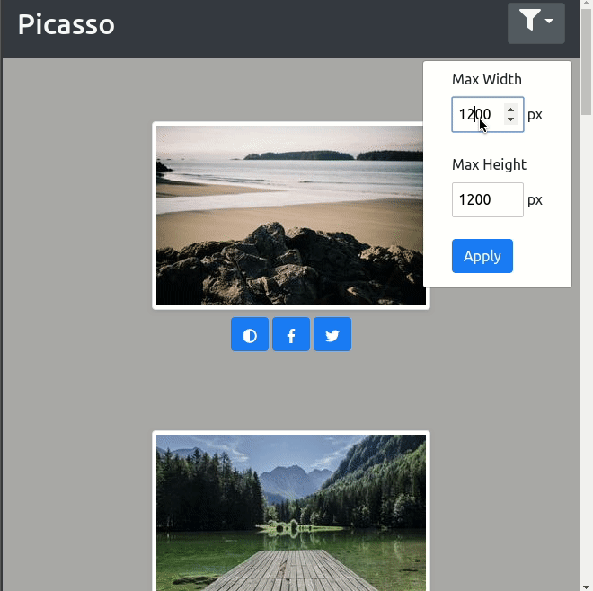
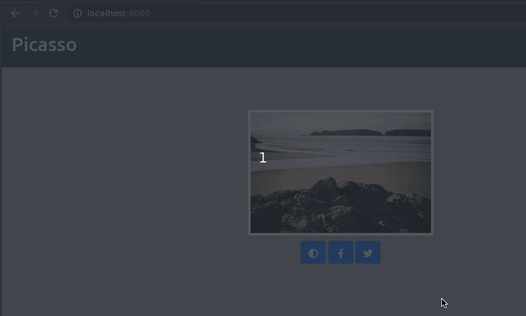

# Picasso

A web-based image viewer application

## Project Architecture

This project consists of two microservices:
* A [Python](https://www.python.org/about/) backend application built mainly with [Flask](https://palletsprojects.com/p/flask/), [SQLAlchemy](https://www.sqlalchemy.org/) and served with [uWSGI](https://uwsgi-docs.readthedocs.io/en/latest/).
* A [Svelte](https://svelte.dev/)-based frontend application which uses [nodejs](https://nodejs.org/en/about/) for development, [Font Awesome](https://fontawesome.com/), [Bootstrap](https://getbootstrap.com/docs/4.3/getting-started/introduction/) and [Sass](https://sass-lang.com/) for theming. Svelte compiles down to vanilla JS/HTML/CSS via [rollup](https://rollupjs.org/)

## Execution Environment

### Docker (recommended)

This project can run entirely in [Docker](https://www.docker.com/) containers, thus requiring almost no manual host configuration. Install [Docker CE](https://docs.docker.com/v17.09/engine/installation/) and [Docker Compose](https://docs.docker.com/compose/install/).

Now, simply run `docker-compose up` from the root project directory (where this file is located) to launch the application. You should then be able to navigate to `http://localhost:8080` and see the `Picasso` frontend.

### Native

#### Python

Use [pyenv](https://github.com/pyenv/pyenv) to manage Python versions. Ensure you are using Python 3.7. Create a virtualenv:
```bash
pyenv virtualenv 3.7.2 picasso
```

Create a Python version record in the `picasso-backend/` directory:
```bash
echo "picasso" > .python-version
```

Now install all project dependencies (assuming you are in the `picasso-backend/` directory):
```bash
pip install -r requirements.txt
```

Now launch the application (serving on :8000):
```bash
uwsgi --ini uwsgi.ini
```

#### Nodejs

Use [nvm](https://github.com/nvm-sh/nvm) to manage Nodejs versions. Ensure you are using Node 12.13. From the `picasso-frontend` directory, run:
```bash
npm install
npm run build
```

Now, launch the application (serving on :5000):
```bash
npm run start
```

## Features

### Responsivity

The UI is designed with Bootstrap and responsive CSS classes:

Desktop




Mobile




### Image Options

Each image has its own associated controls. There are global controls such as filter parameters and pagination.

#### Grayscale

Grayscale mode can be toggled on and off.



#### Filters

Images can be filtered based on dimensions.

Select images based on the max width and / or max height.

Invalid filter parameters are captured as error messages for the user.



#### Social Media Sharing

Images can be shared on social media platforms.



### Pagination

